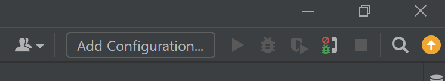
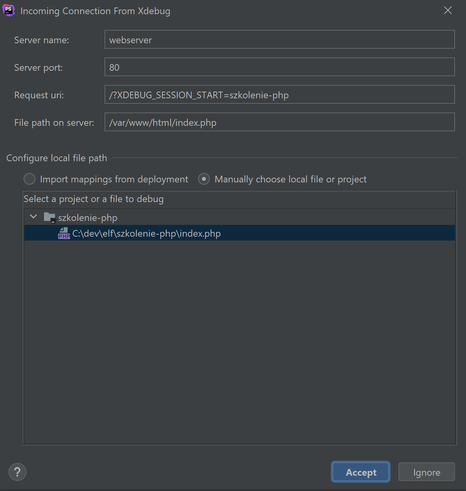

# Konfiguracja PHP + XDEBUG na NGINX
Na potrzeby szkolenia spreparowałem odpowiedni obraz Docker wraz z PHP i włączonym xDebug, a całość jest na nginx.
Szczegóły w odpowiednich plikach oczywiście :)

Jeżeli chodzi o docker-compose to skonfigurowałem tam 2 serwisy:
 - webserver - kontener z nginx skonfigurowanym do obsługi PHP
 - php - PHP w wersji 7.4 FastCGI + xDebug 3

Informacje o konfiguracji xDebug w pliku **xdebug.ini**. PHP działa domyślnie  na porcie 9000, xDebug został skonfigurowany na porcie 9003.
Przed uruchomieniem docker-compose należy utworzyć katalog **szkolenie-php** w miejscu gdzie trzymacie wszystkie projekty dla Workspace.
Pliki z katalogu **szkolenie-php** będą hostowane na nginx.

## PHPStorm i XDebug
Aby włączyć debuggowanie w PHPStorm należy włączyć nasłuchiwanie klikając na ikonę robaczka widocząn na screenie poniżej.

***Uwaga na screenie debuggowanie jest wyłączone***

Następnie w przeglądarce wybrać adres maszyny wirtualnej:

```http://elf-devvm:8080/?XDEBUG_SESSION_START=szkolenie-php```

aby rozpocząć proces debugowania (nazwa sesji może być dowolna).

Pierwsze uruchomienie debbugowania spowoduje pojawienie się poniższego okna w PHPStorm.

Bez zmian należy zaakceptować przychodzące połączenie.

Od teraz można dowolnie debuggować aplikację.

## Instalowanie nowego oprogramowania
Na kontenerze **php** jest zainstalowany composer. Aby cokolwiek instalować należy wejść do powłoki tego kontenera wykonując z wiersza poleceń (po wejściu przez SSH na maszynę wirtualną) następującą komendę:

```docker exec -it elf-environment_php_1 bash```

Z poziomu linii poleceń kontenera możliwe będzie instalowanie bibliotek wykorzystując composera.

